# Chicken (Chick-fil-A app)

The goal of this project is to replicate the existing [Chick-fil-A One](https://itunes.apple.com/us/app/chick-fil-a/id488818252?mt=8) mobile application using React Native. This project is designed to illustrate my capabilities as a React Native developer to potential employers.

# Screenshots
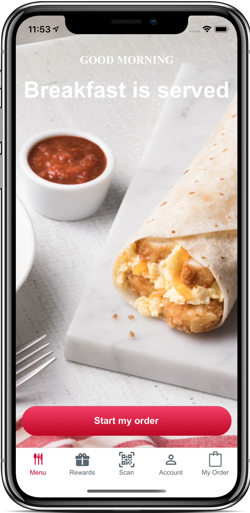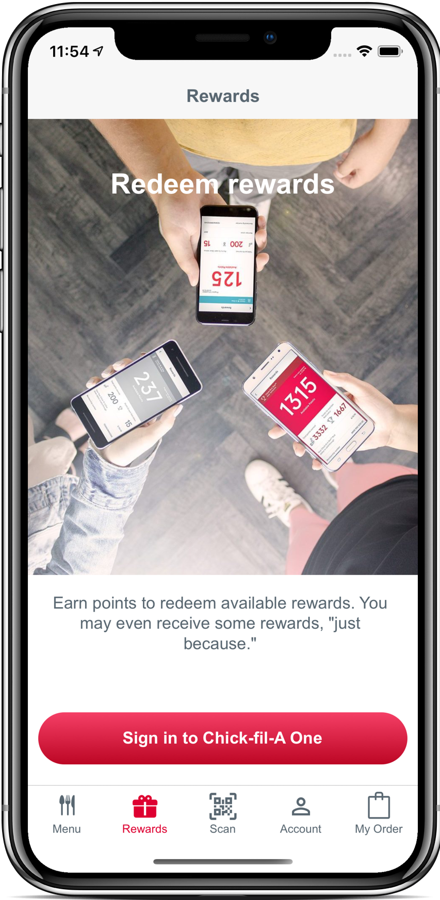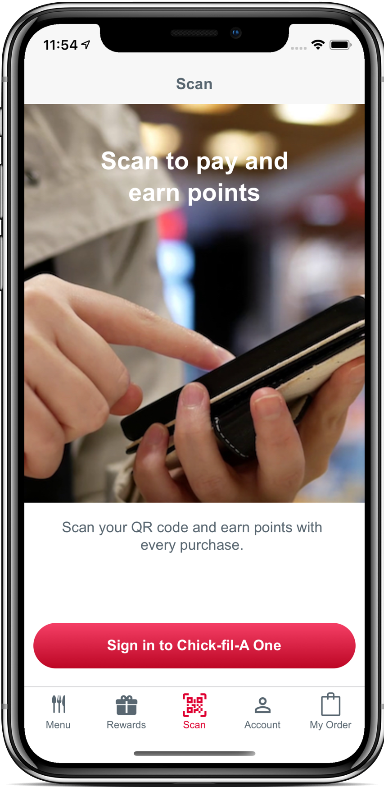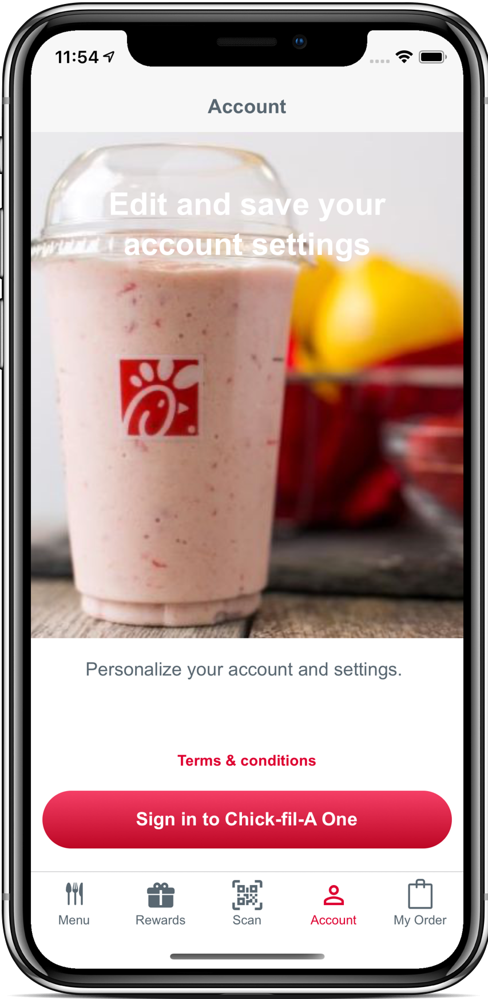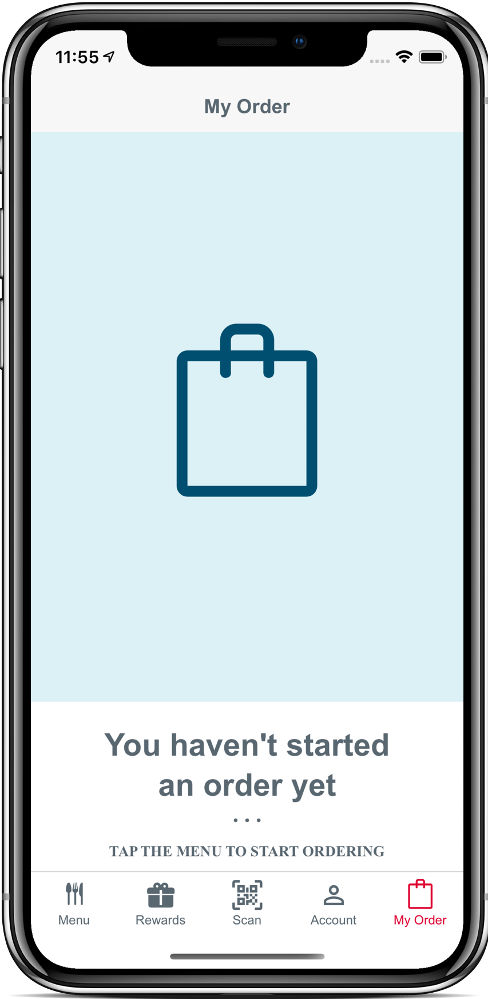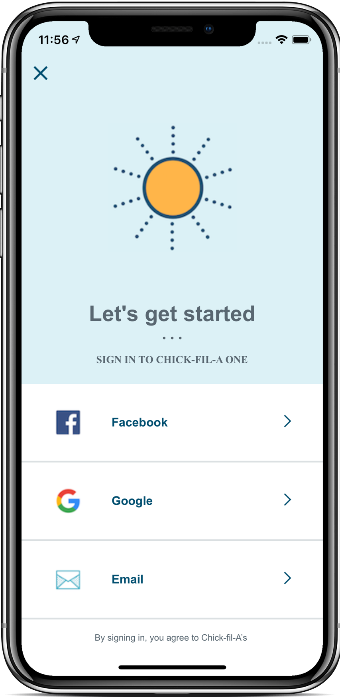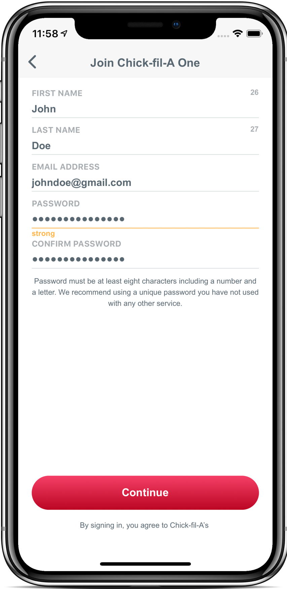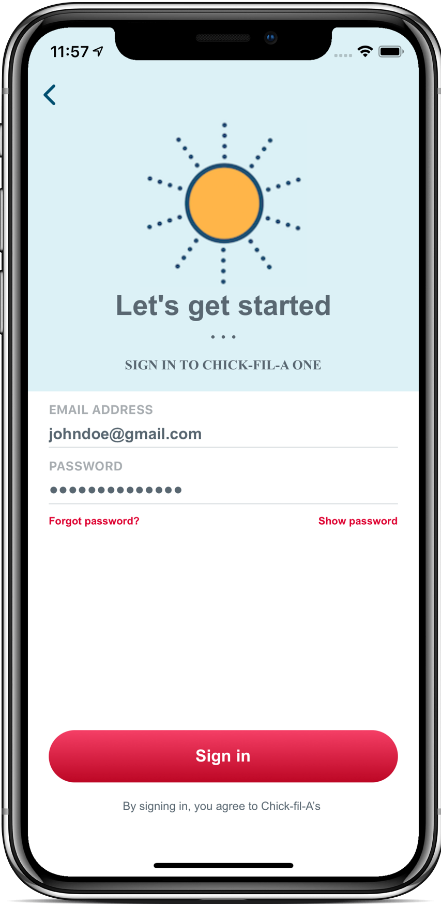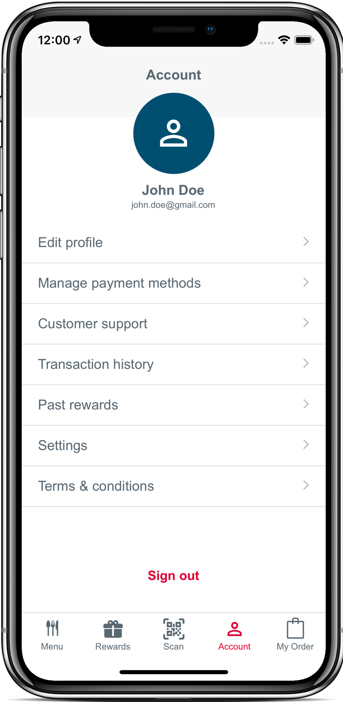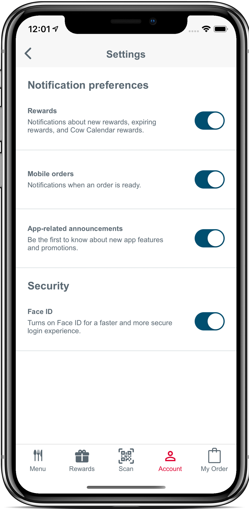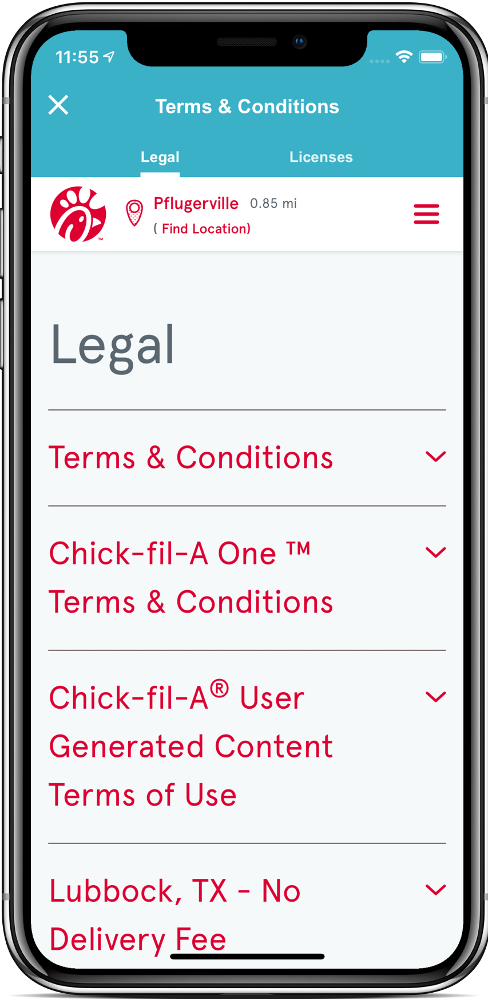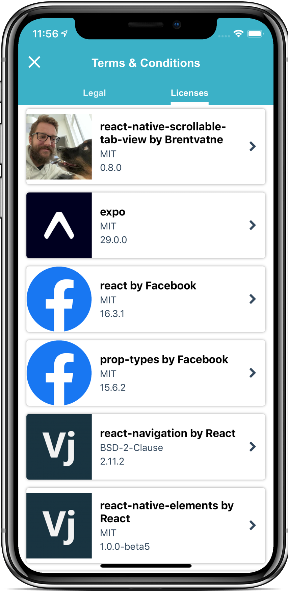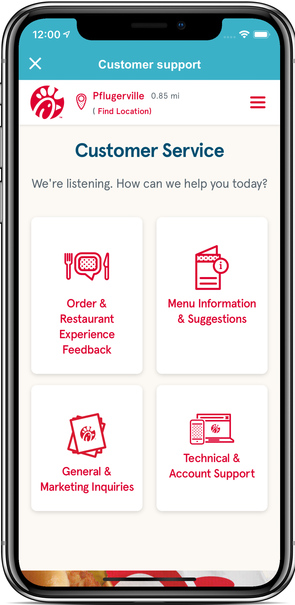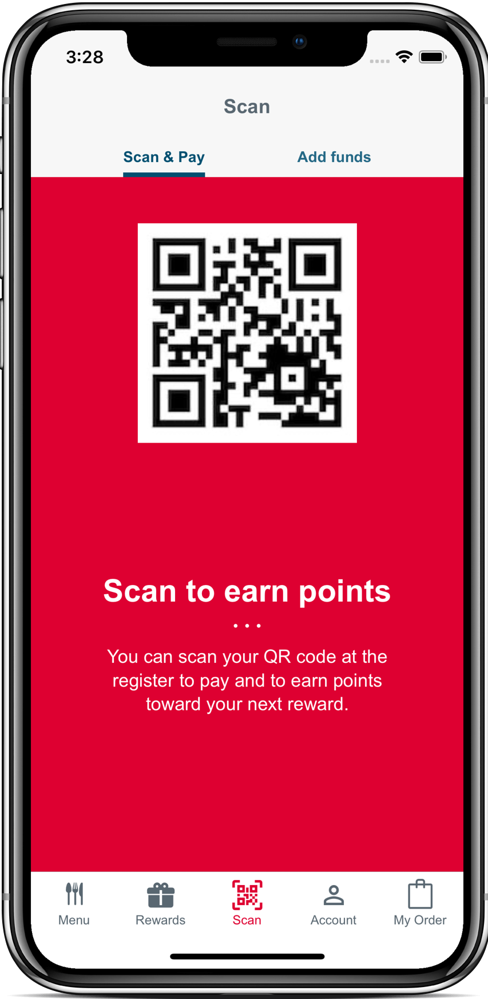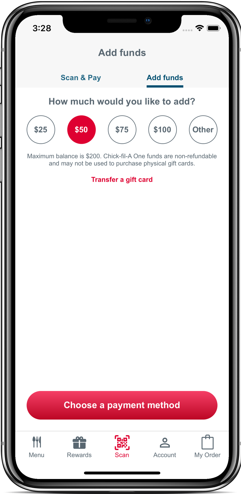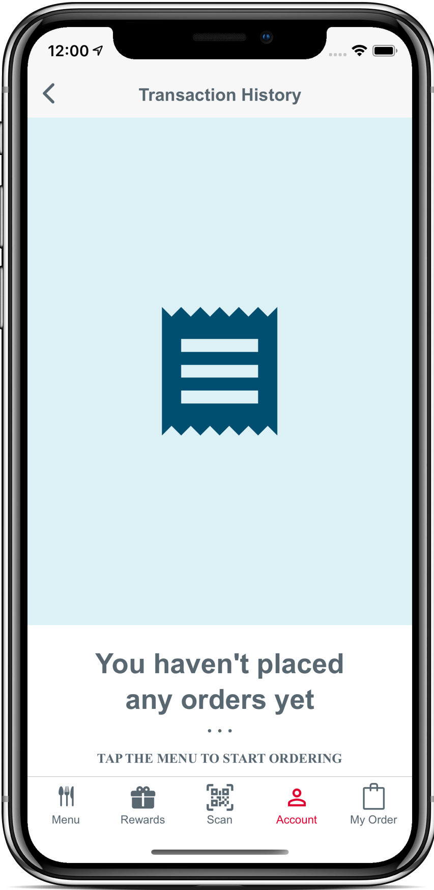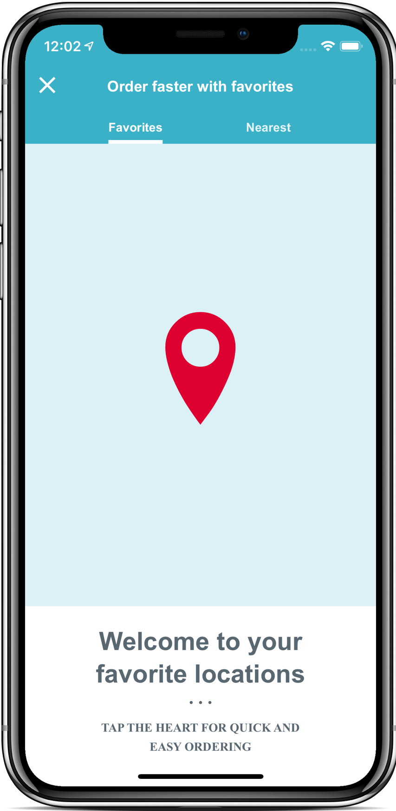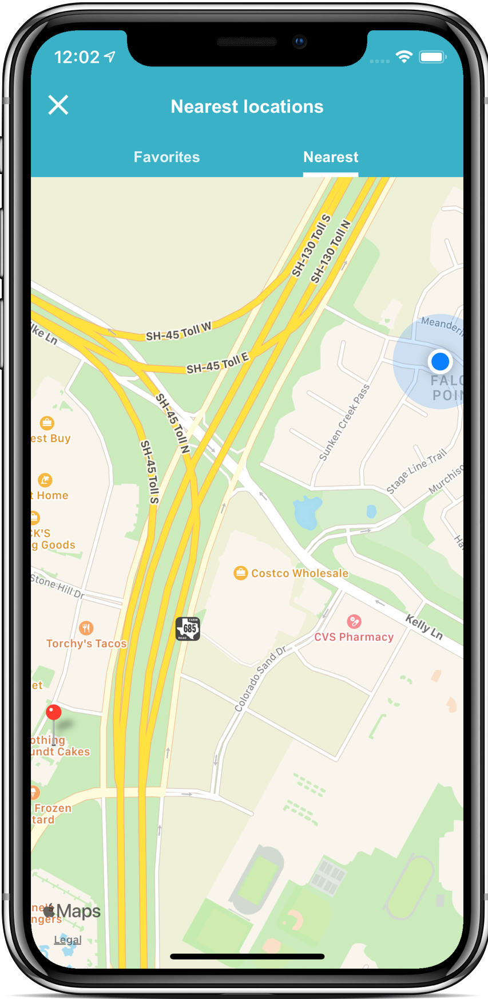

## Why This?

When I initially started looking for new React Native opportunities in my area, I came across a firm called The BHW Group. On their projects page, they listed an application for [Chick-fil-A](https://thebhwgroup.com/projects/chick-fil-a). I then decided that one way to demonstrate my capabilities as a React Native developer, would be to replicate Chick-fil-A's app as closely as I could. Also, it didn't hurt that I'm a big fan of their food.

## Development Environment Setup
  - Install Node.js using your preferred method.
  - Install the Expo CLI globally
    -  `npm install -g expo-cli`
 -  Within the repository (chicken/chicken), run the following commands in Terminal:
    -  `npm install`
    -  `npm start`
    -  It will eventually prompt you to run on a device or simulator. Type `i` and press `enter`.
       -  This will launch an iPhone simulator (provided you're using a Mac).
       -  This application was originally optimized for an iPhone 11 Pro.
    -  You should be able to make changes and save to see them appear.

## Branches

- master: Should be stable and ready to demo at any time.
- development: Active development directly on this branch as well as merged in from feature branches.

## Coding Style and Linting

Coding style consistency is important to me. This project was styled based on input from the Prettier plug-in for VSCode as well as an ESLint configuration that I've grown fond of which can be found in the devDependencies of package.json.

## Designs

Even though I have the existing production application available to base my work off of, I intend to pretend that I don't and will be building out the screens in [Sketch](https://www.sketchapp.com).

Doing this will serve multiple purposes:

- Reinforces my understanding of the application design.
- Gain familiarity with a popular design program.

The Sketch files are available in the 'designs' directory.

## Nearest Locations

I built a web scraper which can be found [here](https://github.com/maxmagee/chick-fil-a/tree/master/server) to get all of the addresses of all of Chick-fil-A's locations. Once I had those and cleaned up the data, I used a website to convert those addresses to lat/long coordinates. 

With those coordinates, I was then able to have the app find the nearest location(s) using an ever-expanding circle centered around your current location. The location screenshot you see there was not pre-determined, if you simulate or run this at another address, you will get different results.

## Authentication

When I initially built this project, I had e-mail authentication functioning using [AWS Cognito](https://aws.amazon.com/cognito/). There have been several changes in the libraries used since the initial implementation, so I disabled that feature.

## Deployment

It's likely that I will publish this project to my personal [Expo Projects listing](https://expo.io/@maxmagee), but due to [recent restrictions by Apple](https://blog.expo.io/upcoming-limitations-to-ios-expo-client-8076d01aee1a), it's no longer possible to run Expo projects from other users in the iOS Client. Consequently, publishing there is simply to aide in my personal demos. I will not be publishing this to the App Store for obvious copyright reasons.

## Built With

- [React Native](https://facebook.github.io/react-native/) - A platform to build native apps using JavaScript and React.
- [Expo](https://expo.io/features) - A toolchain and publishing platform for React Native.
- [React Navigation](https://reactnavigation.org) - Provides routing and navigation for React Native apps.
- [AWS Cognito](https://aws.amazon.com/cognito/) - Provides user sign-in and sign-up capabilities.
- [Sketch](https://www.sketchapp.com) - A MacOS design application.

## Authors

- **Max Magee** - [Website](http://maxmagee.com)

## Note

This repository is actually the second version. I was originally replicating the app here: [https://github.com/maxmagee/chick-fil-a](https://github.com/maxmagee/chick-fil-a)

However, Chick-fil-A completely redesigned their application while I was in the middle of my implementation. Consequently, I decided to start fresh on a new version and tackle the new challenges the redesign presented.

After looking at their license page in the app, it appears as though they might have actually moved the app over to be completely native. I noticed several more Swift / iOS specific dependencies after looking at it in the new version (6.0+).

That doesn't change the usefulness of this exercise though. Instead, if I can make my React Native version indistinguishable from a fully native app, that's even more impressive.

## Acknowledgements

- [The BHW Group](https://thebhwgroup.com) for the inspiration.
- [Chick-fil-A](https://www.chick-fil-a.com) for the tasty waffle fries and ignoring any possible legal issues.
